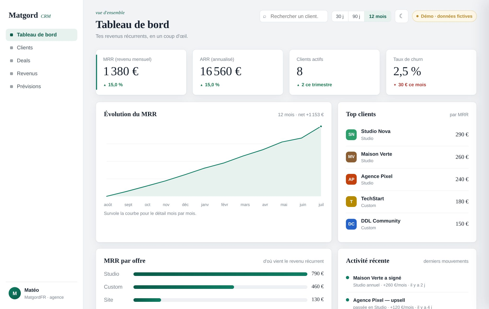

# MatgordCRM — démo (CRM + suivi du MRR)

Démo vitrine d'un **CRM avec analytics de MRR** (revenu mensuel récurrent), pensé pour une petite agence / un freelance. **Zéro dépendance, zéro framework, zéro CDN** — tout en HTML/CSS/JavaScript vanilla, graphiques compris.

> ⚠️ **Projet démo.** Toutes les données (clients, deals, revenus) sont **fictives**. C'est une vitrine de savoir-faire, pas un produit en production.



## Ce que ça montre

- **Tableau de bord** — KPIs (MRR, ARR, clients actifs, churn), courbe de MRR **avec tooltip au survol**, top clients, MRR par offre, activité récente.
- **Clients** — table **triable** (nom, offre, MRR, ancienneté, statut) + **recherche live** ; clic sur une ligne → **fiche client** (panneau latéral, sparkline, note, deals liés).
- **Deals** — pipeline en **kanban** (lead → discussion → gagné / perdu).
- **Revenus** — MRR décomposé en 4 flux, **waterfall / bridge du MRR** (new · expansion · contraction · churn), et les **métriques SaaS** qu'un investisseur regarde : **ARPU · LTV · Quick Ratio · NRR**.
- **Prévisions** — projection du MRR sur 6 mois selon la tendance (entrées / churn), avec les hypothèses et le détail mois par mois.
- **Thème clair & sombre** (bouton, mémorisé, respecte les préférences système), **animations** (courbe qui se dessine, barres qui poussent, compteurs), responsive, accessible au clavier, `prefers-reduced-motion` respecté.

## Stack

- HTML + CSS + **JavaScript vanilla**, aucun framework, aucune librairie externe.
- Graphiques (aire, barres, waterfall, sparkline) **dessinés à la main en SVG** à partir des données.
- 100 % statique → s'ouvre dans un navigateur ou se sert par GitHub Pages.
- Données cohérentes **dérivées** d'une source unique (les offres somment au MRR, la courbe se déduit des mouvements).

## Structure

```
index.html                → markup
assets/css/styles.css     → design system + thèmes clair/sombre
assets/js/data.js         → jeu de données fictif (source unique)
assets/js/charts.js       → graphiques SVG (aire, barres, waterfall, sparkline)
assets/js/app.js          → vues, interactivité, métriques, thème
```

## Lancer en local

Ouvre `index.html` dans ton navigateur — ou sers le dossier (`python3 -m http.server`). C'est tout.

## Démo en ligne

👉 https://matgordfr.github.io/matgord-crm-demo/

## Auteur

Réalisé par **MatgordFR** — dev indépendant (bots Discord, sites, IA).
Portfolio : https://matgord.com · GitHub : https://github.com/MatgordFR

## Licence

[ISC](LICENSE) — libre d'usage.
